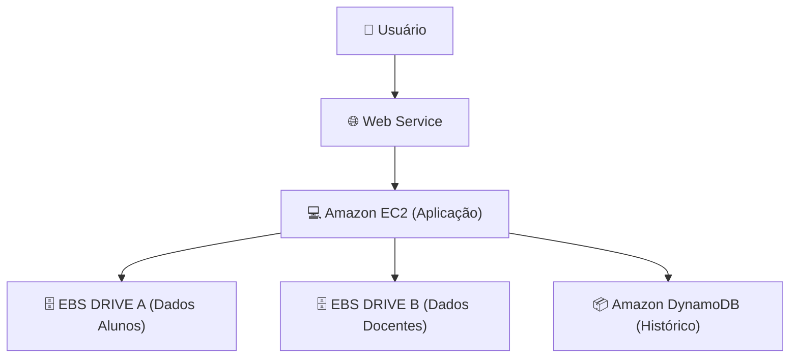

# Arquitetura AWS - Sistema de Consulta Institucional (Aluno/Docente)

Este sistema foi projetado para permitir a **consulta de dados de alunos e docentes** em uma instituição de ensino, utilizando serviços da **AWS** de forma escalável e persistente.

---

## 📌 Componentes

- **Amazon EC2**  
  - Hospeda a aplicação principal (web service).  
  - Processa requisições de usuários (alunos/docentes).  

- **Amazon EBS DRIVE A (Alunos)**  
  - Volume de armazenamento persistente dedicado a dados de **alunos**.  
  - Mantém informações que precisam sobreviver a reinicializações da instância EC2.  

- **Amazon EBS DRIVE B (Docentes)**  
  - Volume de armazenamento persistente dedicado a dados de **docentes**.  
  - Separa a camada de armazenamento para organização e maior clareza de gestão.  

- **Amazon DynamoDB**  
  - Banco de dados NoSQL totalmente gerenciado.  
  - Armazena **dados históricos** de alunos e docentes, garantindo escalabilidade e alta disponibilidade.  

---

## 🔗 Fluxo da Arquitetura

1. O **usuário** acessa o sistema por meio do **Web Service**.  
2. O **Web Service** está hospedado em uma instância **EC2**, que processa as requisições.  
3. Os dados imediatos são armazenados em volumes **EBS**:  
   - EBS DRIVE A → dados de **alunos**.  
   - EBS DRIVE B → dados de **docentes**.  
4. Dados antigos ou menos acessados são movidos/armazenados no **DynamoDB** para consultas históricas.  

---

## 📊 Diagrama Minimalista

